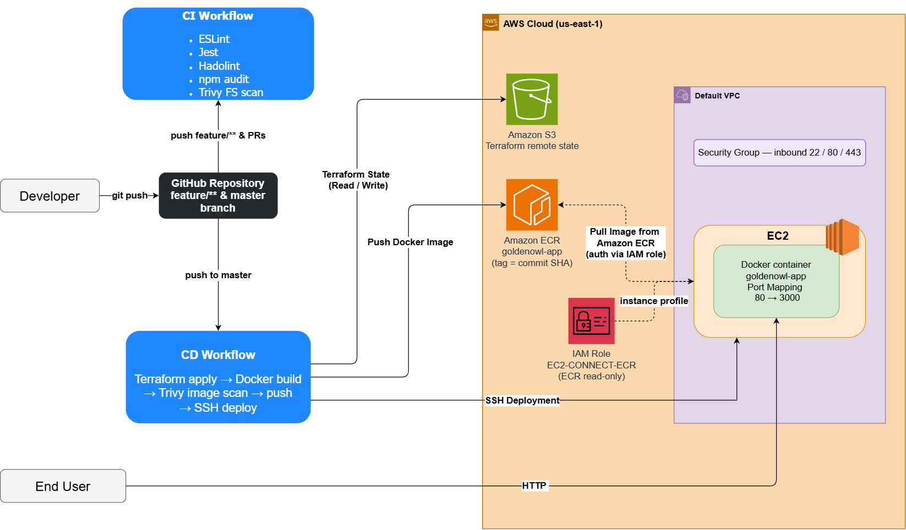

# Golden Owl DevOps Internship Challenge

A production-inspired DevOps project demonstrating Infrastructure as Code (IaC), containerization, automated CI/CD, container image security scanning, and deployment on AWS.

The project provisions AWS infrastructure using Terraform and automatically builds, scans, publishes, and deploys Docker images through GitHub Actions.


---

# Features

- Infrastructure as Code with Terraform
- Automated CI/CD using GitHub Actions
- Docker containerization with BuildKit layer caching
- Container image vulnerability scanning with Trivy
- Amazon Elastic Container Registry (ECR)
- Automated deployment to Amazon EC2
- Remote Terraform state stored in Amazon S3
- Secure secret management using GitHub Secrets

---

# Tech Stack

| Category | Technology |
|-----------|------------|
| Cloud | AWS |
| Infrastructure as Code | Terraform |
| CI/CD | GitHub Actions |
| Container | Docker |
| Registry | Amazon ECR |
| Compute | Amazon EC2 |
| Security | Trivy, Hadolint, npm audit |
| State Backend | Amazon S3 |

---

# Architecture



---

# CI/CD Pipeline

## CI — on every `feature/**` push and pull request

Four parallel checks: ESLint + Jest tests, Hadolint (Dockerfile), npm audit (production dependencies), and Trivy filesystem scan.

## CD — on every push to `master`, three chained jobs

### 1. Provision Infrastructure

Terraform provisions and updates AWS resources (EC2, Security Group, ECR, key pair, instance profile) and exports the instance IP and ECR URL for the next jobs.

### 2. Build & Scan Image

- Build the Docker image with Buildx layer caching
- Scan the image with Trivy — the pipeline **fails on HIGH/CRITICAL vulnerabilities**, so insecure images never reach the registry
- Push to Amazon ECR, tagged with the commit SHA (immutable, traceable deployments)

### 3. Deploy Application

- SSH into EC2
- Login to Amazon ECR (auth via IAM instance role — no AWS keys stored on the server)
- Pull the image tagged with the commit SHA
- Replace the running container (host `:80` → app `:3000`)
- Prune unused images

---

# Repository Structure

```
.
├── .github
│   └── workflows
│       ├── ci.yaml          # Continuous Integration
│       └── cd.yaml          # Provision infrastructure + deploy
│
├── terraform                # main.tf, variables.tf, outputs.tf, provider.tf
│
├── docs                     # Architecture diagrams (draw.io source + PNG)
│
├── src                      # Node.js application + tests
│
├── Dockerfile               # Multi-stage production image
│
└── README.md
```

---

# GitHub Secrets

| Secret | Description |
|----------|-------------|
| AWS_ACCESS_KEY_ID | AWS IAM Access Key |
| AWS_SECRET_ACCESS_KEY | AWS IAM Secret Key |
| AWS_SSH_KEY_PRIVATE | SSH private key for EC2 deployment |
| AWS_SSH_KEY_PUBLIC | Public SSH key used by Terraform |
| AWS_TF_STATE_BUCKET_NAME | Terraform remote state bucket |

---

# Design Decisions

| Decision | Reason |
|---|---|
| Terraform | Infrastructure is version-controlled, reviewable, and reproducible |
| GitHub Actions | CI/CD integrated directly with the repository, no extra infrastructure |
| Amazon ECR | Managed registry, tightly integrated with AWS IAM and EC2 |
| Docker build cache | Only modified layers are rebuilt, significantly reducing build time |
| Trivy scan gate | Images with HIGH/CRITICAL vulnerabilities are blocked before deployment |
| Amazon EC2 | Full control over the environment, simple for a single-node deployment |
| S3 remote state | Consistent Terraform state between local runs and GitHub Actions |
| Commit-SHA image tags | Every deployment is traceable and can be rolled back to an exact version |

---

# Future Improvements
- Deploy applications using Amazon ECS/Fargate
- Implement Blue/Green deployment strategy
- Configure HTTPS using ACM and Application Load Balancer
- Support multiple environments (Development, Staging, Production)
- Add monitoring using Prometheus and Grafana
- Configure centralized logging
- Implement Auto Scaling Group for high availability

## References

[Complete CI/CD with Terraform and AWS | Terraform Tutorial | DevOps Project | AWS | Cloud-Native](https://www.youtube.com/watch?v=5sZAx2ylsOo&t=520s) 


